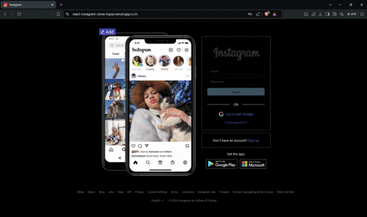

# React Firebase Instagram Clone

A Full-stack Instagram clone built with React.js and Firebase, featuring user authentication (login, signup, reset password), following other users, creating and managing posts, and commenting, offering a full social media experience.


<div align="center">



</div>


## Tech Stack

- 
- 
- 
- 
- 
 
## Features

### User Experience:

- Start by logging in to personalize your experience. Don't worry you can log out later or reset your password if you forgot.

- Edit your profile by updating your profile picture, adding a bio, and changing your username or full name.

- Follow other users to see their latest posts in your home page feed.

- Engage with content by liking posts and leaving comments.

- Create and share your own posts with engaging captions.

- Search for users to expand your network and view their profiles and posts.


### Tech Functionalities

- Built a single-page application **(SPA)** with `react-router-dom`.

- Implemented **user authentication**, **form validation**, and **password reset** functionality using **Firebase** and `react-firebase-hooks`.

- Utilized **Firebase Storage** for image uploads and generating re-usable URLs for these images

- Implemented **CRUD operations** across both the front end (using React states) and the back end (using Firestore), ensuring data integrity and consistency.

- Employed **Firestore** to store and retrieve user data and posts by performing data queries, with strict security rules, allowing only authenticated users to perform any writing operation.

- used **custom hooks** and **react context API** to **manage global states** (changing posts, updating profiles, liking and commenting) and **avoid prop drilling.**

- Utilized `@chakra-ui/react` for building smooth UI features and enhancing the user experience like **loading skeletons**, **modals**, **toasts** (to indicate errors, unauthenticated actions, and successful operations), **tooltips**, **loading buttons**, and more.

## Privacy Terms

Please note that all images, comments, and post captions you upload to the web application will be securely stored in Firestore. These data points will be handled responsibly and will not be misused in any way.

For users signing in with **email**, only your email address will be visible to the developer, while your **password** is securely managed by Firebase and remains inaccessible.

For users signing in with **Google**, the login process will provide the application with your **email address**, **profile picture**, and basic account information. The developer will only utilize **the email address**, **username**, **profile picture** to create your user profile, and no other data will be accessed or used without **your explicit consent**.

**Your privacy and data security are paramount.**

## Run Locally

Clone the project

```bash
  git clone https://github.com/AdhamElRouby/React-Instagram-Clone
```

Go to the project directory

```bash
  cd .\React-Instagram-Clone
```

Open with VSCode

```bash
  code .
```

Install dependencies

```bash
  npm install
```

Open with live server

```bash
  npm run dev
```

## Contributing

I welcome contributions to this project! Feel free to submit pull requests and suggest improvements. 
If you have any questions or need assistance, don’t hesitate to contact me at adhamelrouby@aucegypt.edu.
